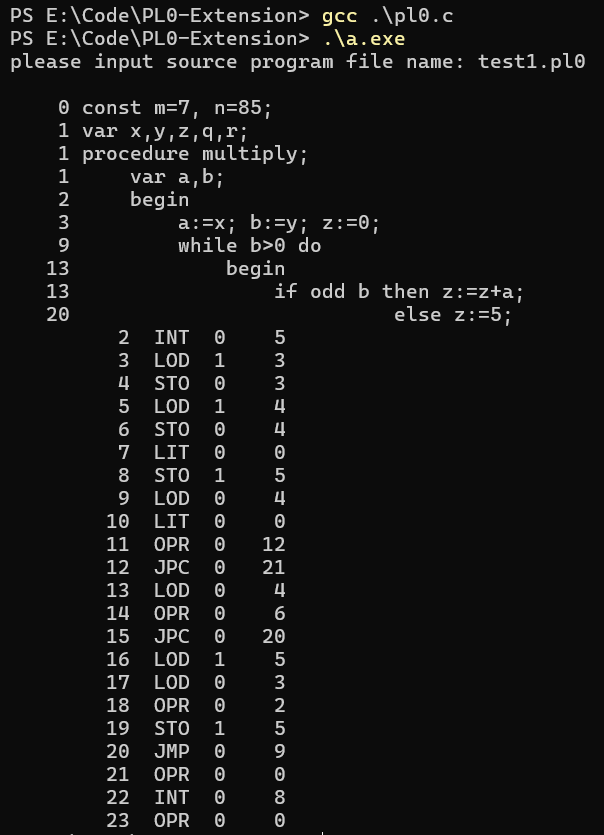
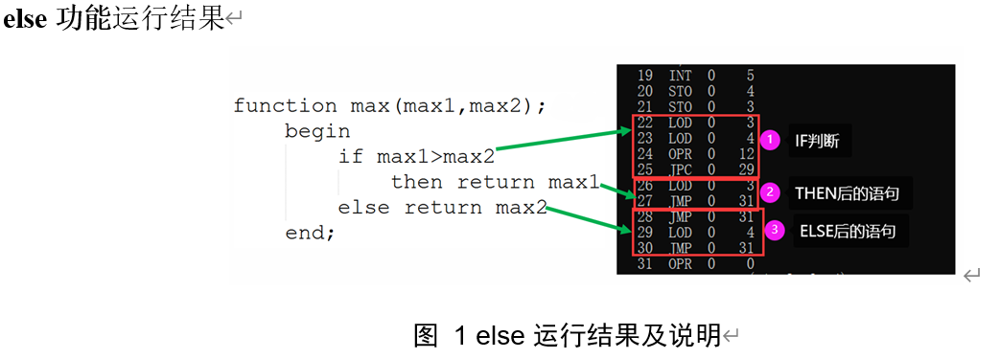
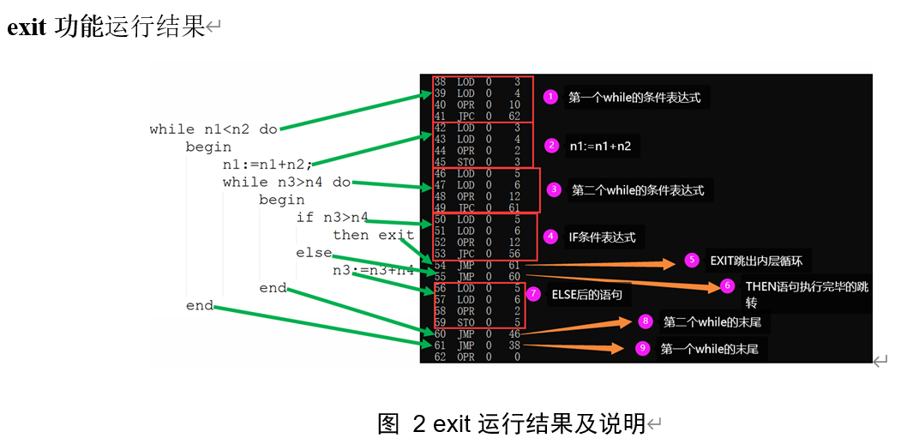
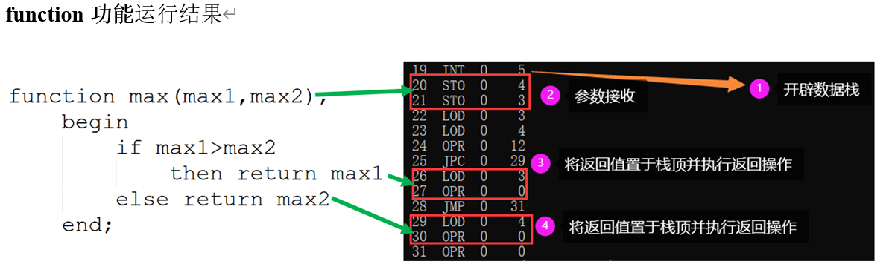
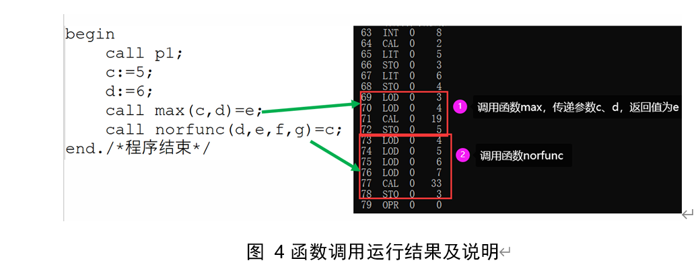

# README

## 运行

Windows：

```shell
gcc .\pl0.c
.\a.exe
please input source program file name: test1.pl0
```

可以得到以下结果：




## 说明

- 这是一个很一般的编译原理课程设计，将PL/0的语法进行扩展。

- 项目代码中的注释大部分是正确的，但有一些小细节的语言描述不是很准确。

- 项目的error功能已经关闭掉了。<u>但是由于对语法进行了扩展，原来的错误提示功能并不能覆盖新的语法。</u>


## 完成功能

① 给PL/0语言增加C语言形式的/∗ …… ∗/的注释。 

② 给PL/0语言增加带else子句的条件语句和exit语句。exit语句作为while

语句的非正常出口语句。若处于多层while语句中，则它只作为最内层

while语句的非正常出口。若它没有处于任何while语句中，则是一个错

误。 

⑤ 给PL/0语言增加函数类型。

## 实现思路

### 添加注释

代码首先检查当前字符是否为/，如果是，则继续检查下一个字符。

如果下一个字符是*，则说明是注释的起始。

一直读取字符直到遇到*，然后检查下一个字符是否为/，如果是，则表示注释结束。输出“This is a comment”，表示识别到这是一个注释。

如果下一个字符不是/，则报告错误27，表示缺少注释符号。

当注释处理完毕后，程序会调用getsym()函数继续获取下一个有效的词法单元。

### 修改While

#### 添加ELSE保留字

首先为else保留字添加编码，并在wsym数组中添加相应的字符串。接着在getsym函数中添加识别else保留字的分支，识别到else后，立刻生成一条等待回填的jmp指令，并记录下这个jmp的地址addr。

随后，当if-then-else语句体执行完成后，找到地址为addr的jmp指令并将其多用途a回填为当前的cx(即下一条汇编指令的地址)。

另外，识别到if后的操作也需要修改。当if-then-else语句体执行完成后，找到if生成的jpc指令，并将其多用途a回填为addr+1(也即else语句体的第2条指令，第一条指令为else生成的jmp)。

这样，进入if-then-else语句体时，经条件判断后：或者进入if语句体，正常处理其中的指令后，最终执行jmp指令跳转到整个if-then-else语句体的下一条指令；或者执行jpc先跳转到else语句体的第2条指令，正常执行后面的指令。

#### 添加EXIT保留字

首先为exit保留字添加编码，并在wsym数组中添加相应的字符串。接着在getsym函数中添加识别exit保留字的分支。识别一个或多个exit后，为每一个exit生成一条等待回填的jmp指令，并将这些jmp指令的地址存入数组addr中。

while循环体执行完毕后，找到addr数组并将每一条jmp指令的多用途a回填为当前的cx。这样，在while循环体中每一次遇到exit时，就会执行jmp指令并跳转到while循环体的下一条指令。

### 添加FUNCTION

function的语法结构为：function->paradecl block。

首先为function保留字添加编码，并在wsym数组中添加相应的字符串。接着在block函数中添加识别function保留字的分支。

函数声明：识别function后，先开始处理函数参数声明部分。每识别到一个参数，就将该参数的名字存入到一个数组para中。随后进行对block的处理，进入block后首先判断当前是否function的block，若是则将para数组中的参数变量进行声明，并生成sto指令将栈顶的参数值赋给参数变量，然后开始处理正常的block结构。

return保留字：首先为return保留字添加编码，并在wsym数组中添加相应的字符串。接着在getsym函数中添加识别return保留字的分支。识别到return后，继续读取一个词法单元，若该词法单元为标识符，则首先生成lod指令，将需要返回的变量置于栈顶；接着生成(opr, 0, 0)指令执行返回操作。

函数调用：在getsym中识别到call保留字后添加处理function的分支。识别到function后，首先处理参数变量，生成lod指令将参数变量置于栈顶。随后识别返回结构’= ident’，若存在返回结构，则在cal指令之后生成sto指令，将栈顶的返回值传递给接受返回值的变量。

#### 添加参数的过程，参数传递按值调用方式

首先要增加一个新的枚举值 `param` 以区分过程参数，在符号表中明确表示哪些是过程的参数。同时确保符号表结构能够存储参数的信息，包括参数的层次和地址。

在词法分析和语法分析部分，需要修改处理标识符、常量、变量和过程的相关代码，以支持参数的定义和引用。在过程定义时，增加对参数列表的处理。包括记录参数的信息到符号表中。在调用过程时，处理传递的参数，将它们正确地压入栈中以便后续的操作使用。这些是为了在过程定义和调用时能够正确处理参数，包括参数的传递和使用。

在符号表中增加新的条目以记录过程参数。在编译时将参数的信息存储到符号表中，便于后续的代码生成和执行时使用。

代码生成部分需要修改以支持带参数的过程。在生成过程调用的指令时，增加对参数的处理。确保参数在调用时正确传递。

在解释器中增加对加载和存储参数的支持，确保参数能够按值传递。在解释器执行过程调用时，处理传递的参数，将它们压入栈中以便过程使用。

## 其他说明








